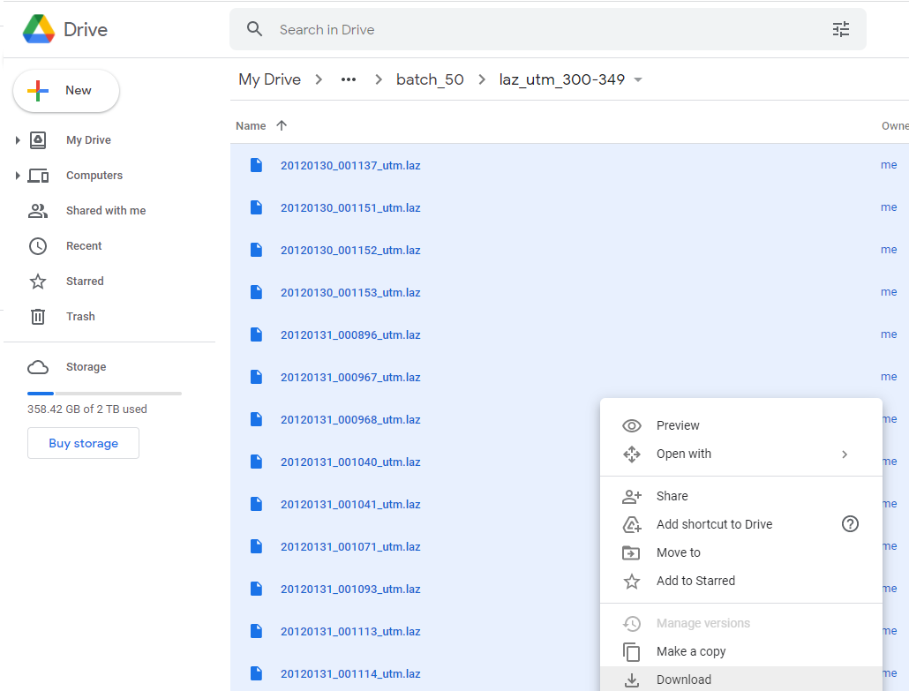

# maryland_rch

Main repository

# Required software

+ CloudCompare
+ QGIS
+ GoogleColab

## Process flow

https://jeffblackadar.github.io/maryland_rch/maryland_rch-lidar.html

## File work areas

There are two file works areas
+ (local drive) local PC: 
```
E:\a_new_orgs\carleton\hist5706-maryland\lidar_files
```
+ (Google Drive) Google Drive: 
```
/content/drive/MyDrive/crane_maryland/
```

### Download files from Google Drive to local drive

There is a constraint that only a 2gb zip file can be downloaded at one time. The .laz files are large so they have been batched into units of 50.
Download each batch.

### Local processing

The local PC has CloudCompare and QGIS installed, these are not available on Google Colab so it's necessary to moved files from Google Drive and process them on a PC and then move them back. Manual tasks but I could not find a better means to process these files using this collection of software.

On the local PC laz files will be converted to DEM using CloudCompare. CloudCompare is not installed on Google Colab so it's used on the local PC.

4 batches of 50 laz files (ex: 0-49, 50-99, 100-149, 150-199) will be downloaed into a folder that can contain 200 files (ex: laz_utm_0-199).

Steps:

1. Create folders to hold downladed files. Example: 
```
E:\a_new_orgs\carleton\hist5706-maryland\lidar_files\reprojected\laz_utm_0-199. 
```

This can be done by running the first cell of 1_1_Maryland_download_laz_tiles_use_CloudCompare_to_convert_to_DEM

2. Manually download the files from Google Drive. Enter the folder and select the files. Verify 50 items selected.
(example):

```
/content/drive/MyDrive/crane_maryland/laz/laz_fema_2012_forested_utm/batch_50/laz_utm_0-49 
```



3. Unzip into directory the appropriate directory to hold 200 files
Extract all

(example) from the zip file of 50 files:

```
E:\a_new_orgs\carleton\hist5706-maryland\lidar_files\reprojected\laz_utm_200-249-20211114T195617Z-001.zip\laz_utm_200-249
```

(example) to the folder to hold a group of 200 files: 
```
E:\a_new_orgs\carleton\hist5706-maryland\lidar_files\reprojected\laz_utm_200-399
```

Download and unzip 4 groups of 50 files into each folder to contain 200 files. Check that the folder has 200 files at the end of each group.

#### CloudCompare

CloudCompare will create a slope shade image file for each .laz. This can be done through CloudCompare's user interface, but to save time, 200 files can be processed one at a time using barch commands. Run CloudCompare commands as a batch using the cell in 1_1_Maryland_download_laz_tiles_use_CloudCompare_to_convert_to_DEM.ipynb

Example: 

```
!"E:\Program Files\CloudCompare\cloudcompare" -SILENT -O E:\a_new_orgs\carleton\hist5706-maryland\lidar_files\reprojected\laz_utm_0-199\20120129_17SQD0990_utm.laz -SET_ACTIVE_SF 8 -FILTER_SF 1.1 2.1 -RASTERIZE -GRID_STEP 1 -EMPTY_FILL INTERP -OUTPUT_RASTER_Z 
```

Change line 11 to the appropriate directory:

Example:
```
input_laz_utm_fp = "E:\\a_new_orgs\\carleton\\hist5706-maryland\\lidar_files\\reprojected\\laz_utm_200-399\\"
```

Run the cell.  It will take several seconds to process each file. Check the directory where the .laz files are. As CloudCompare works, it will create a.bin and a .tif file for each .laz.

####


